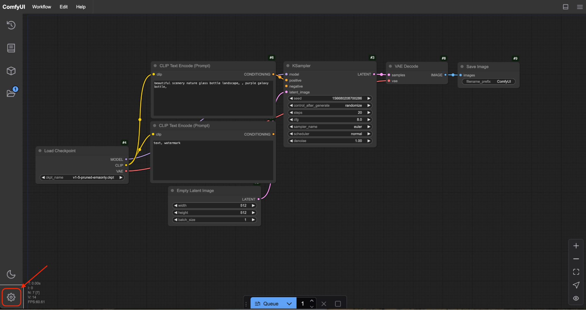
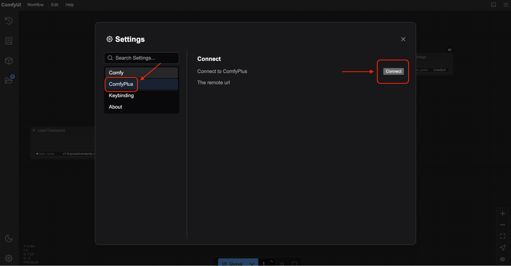
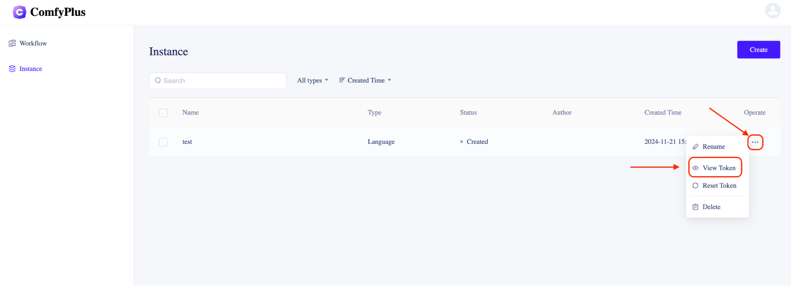
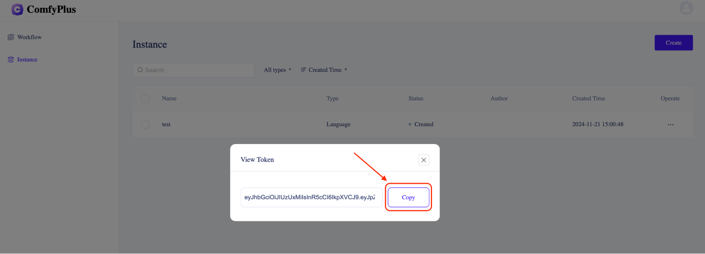
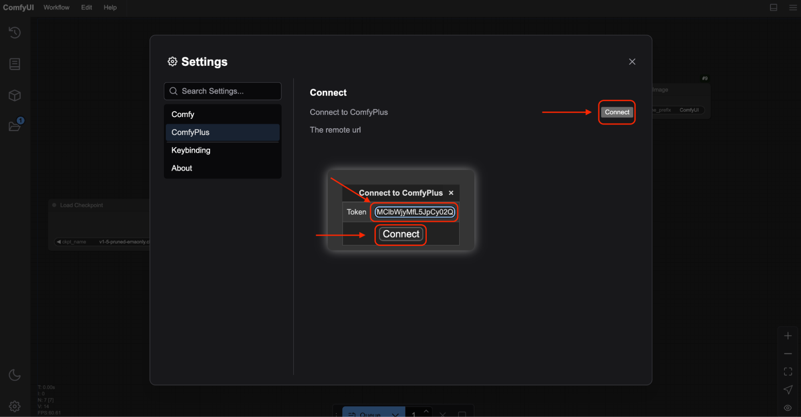

Get Started with **ComfyPlus Anywhere** in Just a Few Steps\!

Setting up and running **ComfyPlus Anywhere** is simple and straightforward. Follow this guide and experience seamless AI workflows like never before\!

**1️⃣ Open CMD and Navigate to the Project Directory**

Run this command to access the directory where you cloned **ComfyUI**:

```bash
cd ComyUI
```

### **2️⃣ Install Dependencies**

Ensure everything runs smoothly by installing required libraries:

```bash
pip3 install -r requirements.txt
```

### **3️⃣ Launch the Project**

Run ComfyUI with a single command:

```bash
python3 main.py
```

or 

```batch
python3 ComfyUI.py
```

**4️⃣ Explore the Documentation**

Need help? The detailed instructions are right in the `README.md`. Check it out:

```
cat README.md
```

### **5️⃣ Troubleshooting Made Easy**

🌟 **Permission Issues?** Add `--user` or use `sudo`:

```
pip3 install --user -r requirements.txt
```

🌟 **Prefer a Virtual Environment?** Isolate your setup:

```bash
python3 -m venv ven
source venv/bin/activate
pip3 install -r requirements.txt
```

🌟 **Encounter Errors?** Visit our [Issues Page](https://github.com/comfyanonymous/ComfyUI/issues) for quick solutions.

### **✅ All Set and Ready to Go\!**

Once installed, you can start using **ComfyPlus Anywhere** to streamline your AI workflows. Customize and configure to suit your needs\!

Don’t wait—dive into the future of AI workflows now\! 🚀



Connecting to an instance is simple:

1️⃣ **Click "Connect"**  
Begin the connection process by clicking the **"Connect"** button.

2️⃣ **Get Your Token**

* Navigate to the **ComfyPlus Dashboard**.  
* Go to the **Instance Management** section.  
* Find and copy the token for the desired instance.





3️⃣ **Paste and Connect**

* Paste the token into the input box as shown below.  
* Click **"Connect"** to complete the process\!

Enjoy seamless access to your instance and take control of your AI workflows effortlessly. 🚀


