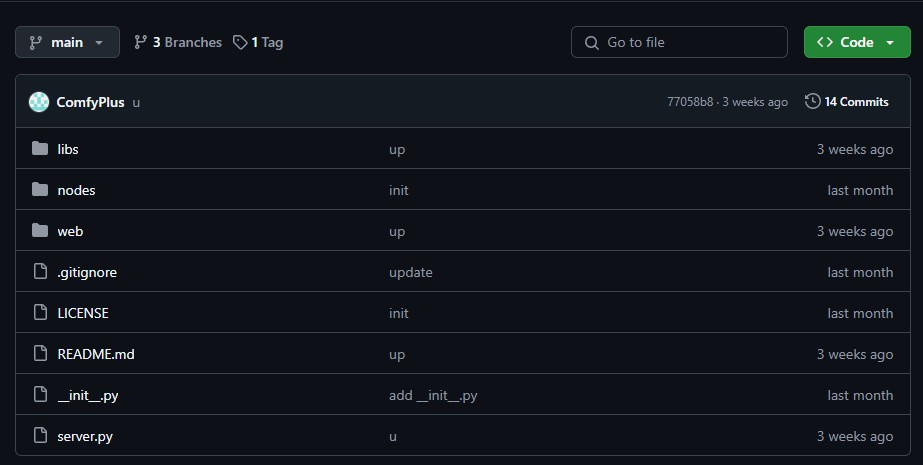
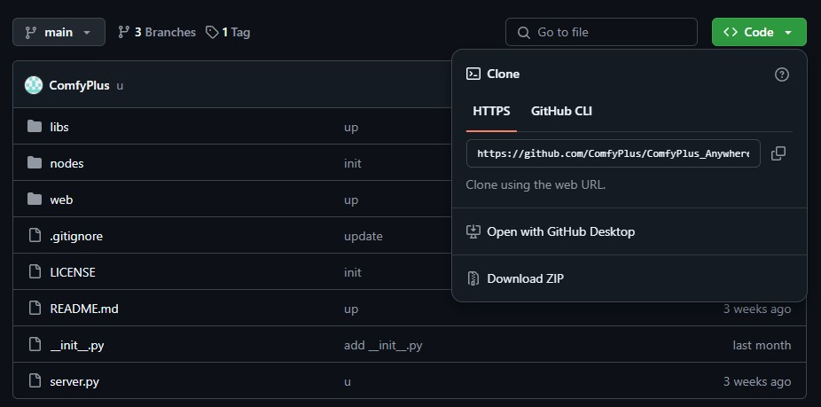

# ComfyPlus_Anywhere

> 一款完全免费的ComfyUI内网穿透插件，让你可以随时随地的访问家里的ComfyUI！

[English](./README.md) | [中文](./README_zh.md) 

### 1. 手动zip安装

首先访问对应仓库地址：https://github.com/ComfyPlus/ComfyPlus_Anywhere

##### (1) 点击页面中 绿色的 `<>code` 按钮，点击弹窗的 `Download ZIP` 按钮



##### (2) 下载完成后解压压缩包

将解压后的文件夹复制到 comfyui/custom_nodes 的插件目录下

##### (3) 重启 ComfyUI ，查看插件是否安装完成

### 2. git安装： 使用 `Git` 命令进行安装

使用 `Git` 安装需要你了解一定的 `Git` 知识，并且需要你预先安装好了`Git`并配置好了（https://git-scm.com/）

##### (1) 首先打开要安装的插件的 `Git` 仓库 https://github.com/ComfyPlus/ComfyPlus_Anywhere

1. 点击页面中 绿色的 `<>code` 按钮
2. 点击弹窗的 `https` 选项下输入框后的复制按钮
    

你将复制得到`ComfyPlus_Anywhere`插件的链接

##### (2) 打开你的 `CMD` 终端，首先使用cd命令进入你ComfyUI 插件所在文件夹，如 `E://ComfyUI_windows_portable/COmfyUI/custom_nodes`

```
cd E://ComfyUI_windows_portable/COmfyUI/custom_nodes
```

##### (3) 等待成功提示。重启 ComfyUI ，查看插件是否安装完成
